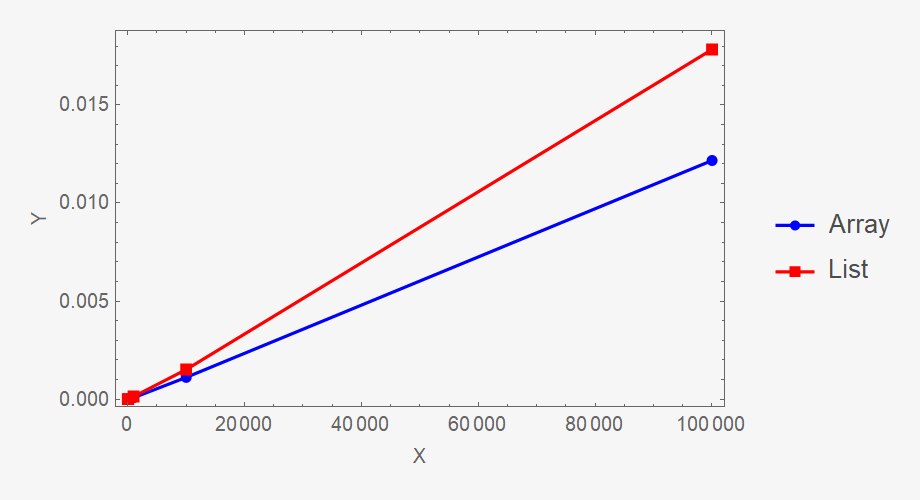
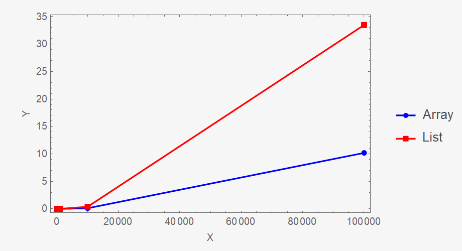
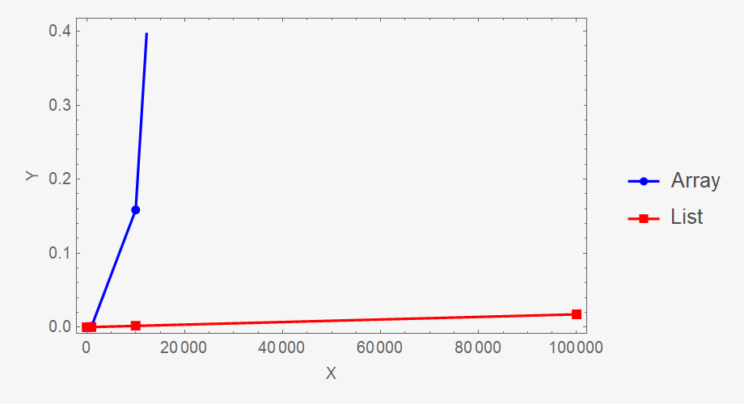

# Quick sort benchmark

## Принцип работы быстрой сортировки

_На каждом шаге функция выбирает опорный элемент, разбивает массив на две части так, чтобы элементы в левой части были
меньше или равны опорному, а элементы в правой части были больше опорного, и затем рекурсивно вызывает себя для
сортировки обеих частей. Процесс повторяется до тех пор, пока массив не будет полностью отсортирован._

## Сравнение скорости сортировки массива и линейного списка

### Тест-1. _Сортировка псевдослучайной последовательности_.

#### Создание массивов и линейных списков размером 10, 100, 1e3, 1e4, 1e5, 1e6, 1e7, 1e8, 1e9.

##### Наполнение структур данных осуществляется генератором псевдослучайных чисел _glibc (used by GCC)_.

###### Проведение для каждой структуры данных по 5 тестов. В таблице представлены средние значения.

|       | 10       | 100      | 1e3      | 1e4      | 1e5      |
|-------|----------|----------|----------|----------|----------|
| Array | 0.000002 | 0.000008 | 0.000084 | 0.001116 | 0.012172 |
| List  | 0.000002 | 0.000008 | 0.000139 | 0.001516 | 0.017832 |

### Тест-2. _Сортировка уже отсортированной последовательности_.

#### Создание массивов и линейных списков размером 10, 100, 1e3, 1e4, 1e5, 1e6, 1e7, 1e8, 1e9.

##### Наполнение структур данных осуществляется генератором псевдослучайных чисел _glibc (used by GCC)_.

###### Проведение для каждой структуры данных по 5 тестов. В таблице представлены средние значения.

|       | 10       | 100      | 1e3      | 1e4      | 1e5       |
|-------|----------|----------|----------|----------|-----------|
| Array | 0.000001 | 0.000013 | 0.001178 | 0.109915 | 10.190043 |
| List  | 0.000002 | 0.000037 | 0.004226 | 0.376206 | 33.480685 |

### Тест-3. _Сортировка отсортированной в обратном порядке последовательности_.

#### Создание массивов и линейных списков размером 10, 100, 1e3, 1e4, 1e5, 1e6, 1e7, 1e8, 1e9.

##### Наполнение структур данных осуществляется генератором псевдослучайных чисел _glibc (used by GCC)_.

###### Проведение для каждой структуры данных по 5 тестов. В таблице представлены средние значения.

|       | 10       | 100      | 1e3      | 1e4      | 1e5      |
|-------|----------|----------|----------|----------|----------|
| Array | 0.000001 | 0.000014 | 0.001042 | 0.158444 | 9.735776 |
| List  | 0.000002 | 0.000010 | 0.000126 | 0.001695 | 0.017286 |

### Быстрая сортировка массива и линейного списка - это два разных подхода к сортировке данных.

+ В быстрой сортировке массива используется метод «разделяй и властвуй». Он заключается в том, что массив разбивается на
  две части, относительно выбранного элемента, и каждая из этих частей сортируется отдельно. Затем производится
  объединение отсортированных частей. Алгоритм эффективен и имеет сложность O(nlogn), где n - количество элементов в
  массиве.

+ В линейном списке применение быстрой сортировки более сложно. Так как в списке элементы не расположены последовательно
  в памяти, для его разделения используется разбиение по опорному элементу, который выбирается из начала списка. Затем
  функция разбиения перемещает все элементы меньше опорного перед ним, а остальные - после него.